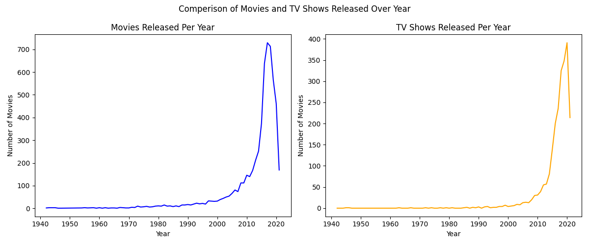
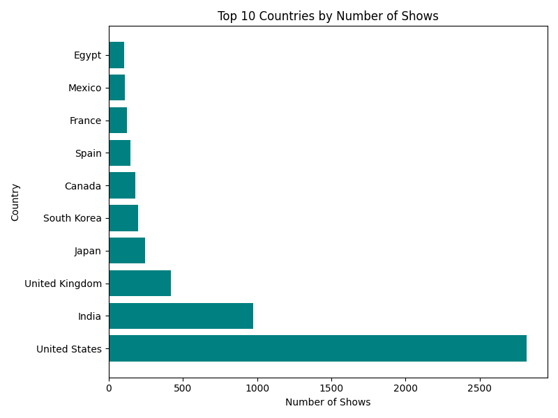
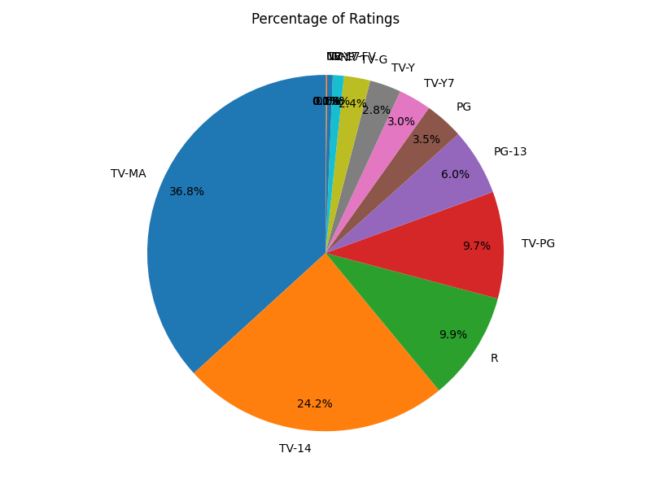
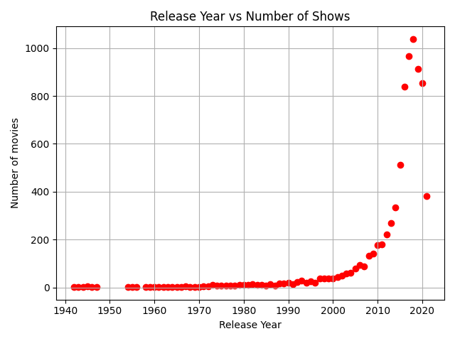
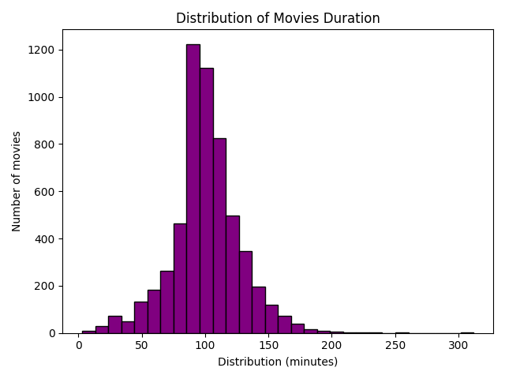

# Visualising Data of Netflix Using Pandas & Matplotlib

A visual exploration of Netflix’s title data using **Pandas** for analysis and **Matplotlib** for visualization.

---

## Project Overview

This project analyzes a dataset of Netflix titles to uncover insights through various visualizations. Key analyses include:

- Comparison between number of **Movies vs TV Shows**
- **Top 10 countries** with the highest number of titles
- Distribution of **content ratings** (Pie chart)
- Relationship between **release year and number of titles**
- **Movie duration** distribution

---

## Contents

| File | Description |
|------|-------------|
| `Netflix.py` | Python script that loads data and generates all charts |
| `netflix_titles.csv` | Source dataset containing Netflix title information |
| `Movies_TV_Shows_Comperision.png` | Bar chart comparing counts of Movies vs TV Shows |
| `Top_10_Countries.png` | Bar chart of the top 10 countries by number of titles |
| `content_rating_pie.png` | Pie chart showing content rating distribution |
| `release_year_scatter.png` | Scatter plot of titles released per year |
| `movie_duration_histogram.png` | Histogram of movie durations |
| `movies_vs_tvshows.png` | Another comparative visualization of movies vs TV shows |

---

## Demo Previews

| Visualization | Image |
|---------------|-------|
| Movies vs TV Shows |  |
| Top 10 Countries |  |
| Content Rating Distribution |  |
| Release Year Scatter |  |
| Movie Duration Histogram |  |

---

## How to Run

1. Clone the repository:
   ```bash
   git clone https://github.com/AmmarBhati11/Visualising-Data-of-Netflix-Using-Pandas-Matplotlib.git
   cd Visualising-Data-of-Netflix-Using-Pandas-Matplotlib
   
2.Install the necessary dependencies:
pip install pandas matplotlib

3.Run the script to generate the plots:
python Netflix.py

The script will generate and save the charts in your current directory.

Dataset Source
The dataset netflix_titles.csv is included in this repository (originally sourced from Kaggle).

Author
Mohammed Ammar Bhati
